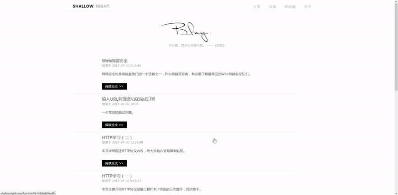
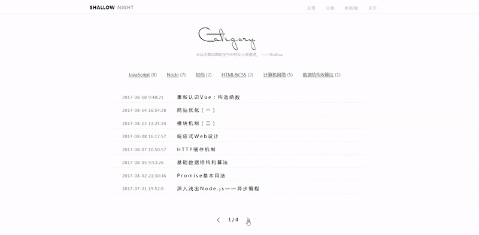
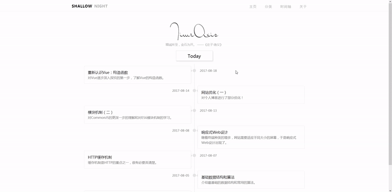

# shallow

> 我的博客网站项目。

## 项目介绍

这是我的个人博客项目的前端部分，后端包括后台和后台管理界面，可以在[shallow-server仓库](https://github.com/Shallownight/shallow-server)查看。

### 文章展示



---

### 分类展示



---

### 时间轴展示



---

## Build Setup

``` bash
# install dependencies
npm install

# serve with hot reload at localhost:8080
npm run dev

# build for production with minification
npm run build

# build for production and view the bundle analyzer report
npm run build --report
```


For detailed explanation on how things work, checkout the [guide](http://vuejs-templates.github.io/webpack/) and [docs for vue-loader](http://vuejs.github.io/vue-loader).

